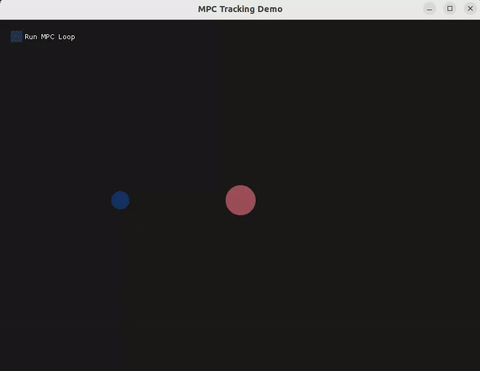

# Linear MPC Visualizer

This project is an interactive 2D tracking simulator that visualizes a double-integrator point mass tracking a draggable target in real-time. The system state (navy blue circle) is controlled by a linear Model Predictive Control (MPC) law solved via the OSQP solver at a constant 20 ms interval. The predicted trajectory planned by the MPC solver is rendered on-screen as a sequence of small, bright cyan hollow circles connecting the current position to the target (light red circle).



## Installation

### Dependencies
Ensure the following development libraries are installed on your system:
- **GLFW3** & **OpenGL** (for rendering)
- **Eigen3** (for matrix algebra)

On Ubuntu/Debian, install them via:
```bash
sudo apt update
sudo apt install build-essential cmake libglfw3-dev libgl1-mesa-dev libx11-dev
```

### Submodule
- **Dear ImGui**: Bundled locally within the `imgui_wrapper/src/imgui` directory. No external installation is needed.

### OSQP Installation
The MPC controller requires **OSQP version 1.0.0** to be compiled and installed globally.
1. Clone and build OSQP v1.0.0 from source:
   ```bash
   git clone --recursive https://github.com/osqp/osqp.git
   cd osqp
   git checkout v1.0.0
   mkdir build && cd build
   cmake ..
   make -j$(nproc)
   ```
2. Install it on your system:
   ```bash
   sudo make install
   ```

### Building the Project
To compile the library and the executable targets:
```bash
cmake -B build -S .
cmake --build build
```
The executables will be built in:
* `./build/mpc/mpc_viz` (Interactive GUI visualizer)
* `./build/mpc/mpc_demo` (Non-graphical math validation script)

---

## MPC Formulation

### System State Space
The point mass is modeled as a 2D double-integrator. The state vector is $x\_k = [p\_x, p\_y, v\_x, v\_y]^T$ (positions and velocities) and the control inputs are $u\_k = [a\_x, a\_y]^T$ (accelerations). The discrete-time state-space dynamics with time step $dt$ are:
$$
x\_{k+1} = A x\_k + B u\_k
$$

$$
A = \begin{bmatrix} 1 & 0 & dt & 0 \\\\ 0 & 1 & 0 & dt \\\\ 0 & 0 & 1 & 0 \\\\ 0 & 0 & 0 & 1 \end{bmatrix}, \quad B = \begin{bmatrix} 0.5 dt^2 & 0 \\\\ 0 & 0.5 dt^2 \\\\ dt & 0 \\\\ 0 & dt \end{bmatrix}
$$

### Condensed Model Formulation
Over a prediction horizon $N$, we express the stack of predicted states $X$ as a function of the initial state $x\_0$ and the stacked control sequence $U$:
$$
X = S\_x x\_0 + S\_u U
$$

where:
$$
X = \begin{bmatrix} x\_1 \\\\ x\_2 \\\\ \vdots \\\\ x\_N \end{bmatrix}\_{4N \times 1}, \quad U = \begin{bmatrix} u\_0 \\\\ u\_1 \\\\ \vdots \\\\ u\_{N-1} \end{bmatrix}\_{2N \times 1}
$$

### 3-Horizon Matrix Assembly ($N = 3$)
For a prediction horizon of $N = 3$, the matrices $S\_x$ and $S\_u$ are assembled as follows:
$$
S\_x = \begin{bmatrix} A \\\\ A^2 \\\\ A^3 \end{bmatrix}\_{12 \times 4}
$$

$$
S\_u = \begin{bmatrix} B & 0 & 0 \\\\ AB & B & 0 \\\\ A^2 B & AB & B \end{bmatrix}\_{12 \times 6}
$$

### Optimization Problem (Quadratic Program)
The MPC objective function penalizes tracking error and control effort:
$$
J = (X - X\_{ref})^T \mathbf{Q} (X - X\_{ref}) + U^T \mathbf{R} U
$$

where $\mathbf{Q} = \text{diag}(Q, \dots, Q)$ and $\mathbf{R} = \text{diag}(R, \dots, R)$ are block-diagonal weight matrices. Substituting the condensed dynamics $X = S\_x x\_0 + S\_u U$ yields:
$$
J = \frac{1}{2} U^T H U + g^T U + \text{const}
$$

$$
H = 2(S\_u^T \mathbf{Q} S\_u + \mathbf{R})
$$
$$
g = 2 S\_u^T \mathbf{Q} (S\_x x\_0 - X\_{ref})
$$

Constraints are compiled into a single bound-constrained matrix expression $l \le M U \le u$:
$$
M = \begin{bmatrix} I\_{2N \times 2N} \\\\ S\_u \end{bmatrix}, \quad l = \begin{bmatrix} U\dots \text{ (truncated for match)} ... \end{bmatrix} ... 
M = \begin{bmatrix} I\_{2N \times 2N} \\\\ S\_u \end{bmatrix}, \quad l = \begin{bmatrix} U\_{\min} \\\\ -S\_x x\_0 + X\_{\min} \end{bmatrix}, \quad u = \begin{bmatrix} U\_{\max} \\\\ -S\_x x\_0 + X\_{\max} \end{bmatrix}
$$

For $N = 3$, the constraint matrix $M$ is:
$$
M = \begin{bmatrix} I\_{6 \times 6} \\\\ S\_u \end{bmatrix}\_{18 \times 6}
$$
